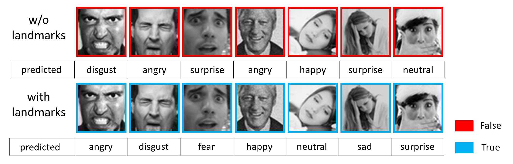

# Landmark-Driven-Facial-Expression-Recognition
A landmark-driven method on Facial Expression Recognition (FER). The module of FER is based on the SCN backbone proposed by the paper "[Suppressing Uncertainties for Large-Scale Facial Expression Recognition](https://arxiv.org/abs/2002.10392)".

Note that the module of FER is **not** the official implementation. All of the code can be only used for **research purposes**.



## Update Logs:
### December 10, 2020
* The source code, pretrained model and some data are released.

## Motivation
We find that some deep-learning methods in the area of FER need to use the pretrained network module which is pretrained on other tasks, such as facial recognition. So we plan to implement a method to avoid employing such a pretrained model.

Nowadays, the facial landmark detection algorithms are very robust and efficient. Then we combine two different tasks into one framework. Experimental results demonstrate that the facial landmark improves the accuracy of FER.

## Dataset
In our experiments, we use the dataset from [FER2013](https://www.kaggle.com/c/challenges-in-representation-learning-facial-expression-recognition-challenge/data).

Image Properties: 48 x 48 pixels, labels: 0=Angry, 1=Disgust, 2=Fear, 3=Happy, 4=Sad, 5=Surprise, 6=Neutral.

**Note**: We use [Dlib](https://github.com/davisking/dlib) library to detect the facial landmark (If one face isn't recognized, the landmark loss of it doesn't count during training). The pretrained model we provide is trained on the subset of FER2013 dataset (since we consider sample inhomogeneity by experiments), it means that the user is encouraged to use the codes and pretrained model as a reference.

## Prerequisites and Installation
- Python 3.8
- Pytorch 1.6.0
- opencv-python 4.4.0.42

### Getting Started
**Clone this repository:**
```bash
git clone https://github.com/RainbowRui/Landmark-Driven-Facial-Expression-Recognition.git
cd Landmark-Driven-Facial-Expression-Recognition
```
**Install dependencies using Anaconda:**
 ```bash
conda create -n fer python=3.8
source activate fer
pip install opencv-python==4.4.0.42 pillow==7.2.0
conda install pytorch==1.6.0 torchvision==0.7.0 cudatoolkit=10.2 -c pytorch
```

Note: the version of 'cudatoolkit' must match the running version of your machine.

## Train
Within ```./Landmark-Driven-Facial-Expression-Recognition``` directory, run following command:
 ```bash
    bash train.sh
```

## Test with Pretrained Model
**Prepare pretrained model:**
- You can download pretrained model here [Google Drive](https://drive.google.com/file/d/1bCIHS6GdTxMnfCjdopzrm5DXsk9bjeQg/view?usp=sharing), or [Baidu Drive](https://pan.baidu.com/s/14pDf39hEliSWmIjKDFYkzA) with password: v0zm.

- Unzip downloaded files and move 'resnet18.pth' into ```./model_save/``` directory.

**Test:**
- Within ```./Landmark-Driven-Facial-Expression-Recognition``` directory, run following command:
 ```bash
    bash test.sh
```

## References

[1] He, Kaiming, et al. "Deep residual learning for image recognition." Proceedings of the IEEE conference on computer vision and pattern recognition. 2016.

[2] Simonyan, Karen, and Andrew Zisserman. "Very deep convolutional networks for large-scale image recognition." arXiv preprint arXiv:1409.1556 (2014).

[3] Wang, Kai, et al. "Suppressing uncertainties for large-scale facial expression recognition." Proceedings of the IEEE/CVF Conference on Computer Vision and Pattern Recognition. 2020.
